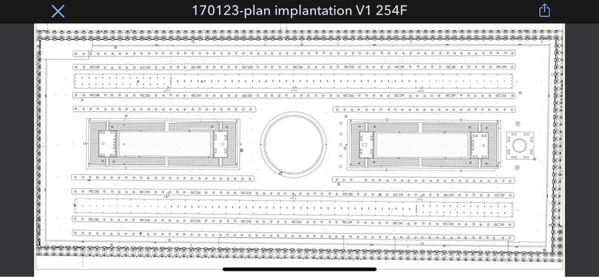
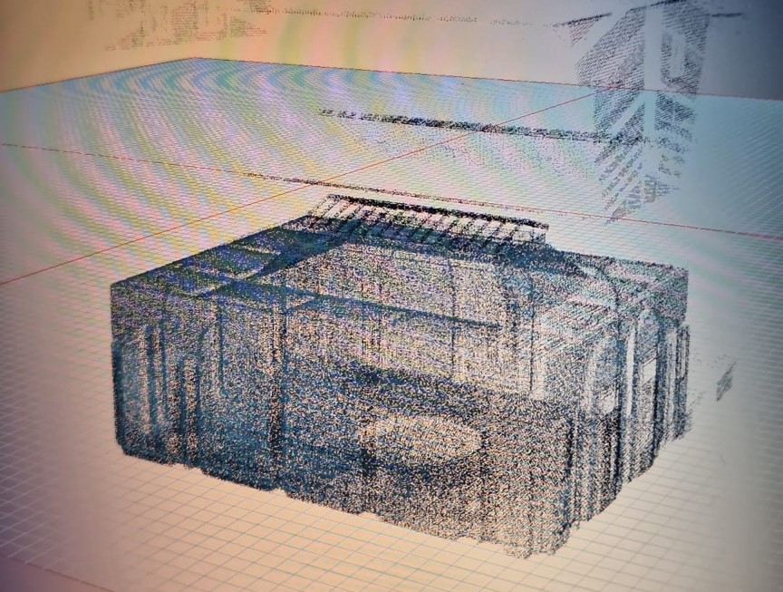

# 2023-08-20-aec-plato-aristotle.md

## Preface

Hello Peter, Stephan and Matt

As you will see below 9a long read), Stephan's message caused me to have a revelation or even an epiphany. As a result I have not even finished reading any of your messages. Not to worry, I will get to them. I will join the discussion. But I really wanted to get the following out to you as soon as possible.

Theo

## Architecture and Philosophy

The other evening Stephan Breuer shared with me by email a number of images of his projects. I was more than intrigued. To my surprise, I was confronted by the realities of modern architectural design, the tools we use and their meaning. I will try to explain what I learned and what I think it means for the future of architecture.

I have been involved with Computer Aided Design (CAD) for over fifty years. A CAD model is a digital representation of a physical object. The digital representation is a collection of points, lines, curves and surfaces. The lines are perfectly straight, the curves ae perfectly smooth and the surfaces are perfectly flat. All the dimension are numerically defined and are mostly small whole numbers (the room is 3 meters x 5 meters) The digital model is a perfect representation of the design.

In a sense the digital model is representation the Plato's concept of the existence of the "Forms" or "Ideas," which are perfect, eternal, and immutable archetypes of the things we see in the world. For example, there is a perfect "Form" of a chair in the realm of Forms, and all chairs in the physical world are imperfect copies of this Form.

* https://en.wikipedia.org/wiki/Theory_of_forms

The image Stephan sent of the plan of his project at the Palais Royal typifies this idea of the perfect digital model. The lines are perfectly straight, the curves are perfectly smooth and the surfaces are perfectly flat.

For decades it has always been this way. The digital model is perfect. The physical model is imperfect. And this is the way Plato would have it.

And this is the way we have been designing buildings since the nineties.

On the other hand, in reality, the actual Palais Royal is, of course, a normal old building full of wear and tear and imperfections.

But: Further down Stephan's message included this image (of a different project).

The image is the lidar scan of an interior space. A lidar scan is a relatively new way a capturing the 3D form of objects in the physical world. A lidar scan is merely a collection of thousands of points in space. The points are not connected by lines or curves. The points are not connected to form surfaces. The points are just points.

https://en.wikipedia.org/wiki/Lidar

A human can look at the points and can surmise that the points indicated a space, but that "knowledge" is not inherent in the points themselves.

In this sense the space reflects an the point of view of Aristotle. Aristotle rejected Plato's theory of Forms. Instead, he believed that the essence of an object is found in the object itself, not in a separate realm of Forms. For Aristotle, the form of an object is its actual structure or organization.

https://en.wikipedia.org/wiki/Empiricism

Lidar has been around for decades. It is only recently that the technology has become affordable and the software has become available to make use of the data. These days there is software that can now connect the points to form lines, curves and surfaces. The software can now create a digital model that is a perfect representation of the physical object.

I don't think there is any specific connection between the two images. It was simply their juxtaposition that hit me. CAD models are shown in designs projects. Lidar scans are shown in as-built projects. But here they were side by side - both being used in design projects.

Seeing the two types of representation side by side woke me up. We now can choose to represent the world in the way that suits us best. You can be Platonic. You can be Aristotelian. You can be both.

The fuzzy Lidar data introduces new ways of thinking about our efforts. With Plato, we deduce starting with general principles (like the Forms) and deducing specific implications from them.

But now with Aristotle's view. We can be more inductive, starting with specific observations and moving to general principles.

## Outcomes

The perfect CAD model will have to learn to live with its imperfect lidar scans. How will this affect our designs? How will this affect our thinking?

The dialectic between Plato sand Aristotle is one of the great discussions in the history of philosophy. It is not my intention to resolve the issue here. But I do want to explore the implications of the two approaches to architectural design.

Perhaps we are bring back some of the aspects of drawing our buildings by hand.

But much more fun, we are adding the idea of the Claude Lévi-Strauss's _bricoleur_.

The traditional CAD operator is the _ingenieur_. The Lidar jockey is the _bricoleur_.

https://en.wikipedia.org/wiki/Bricolage
_
There may even be overlaps with the Cathedral and the Bazaar

https://en.wikipedia.org/wiki/The_Cathedral_and_the_Bazaar.

In the cathedral things are done in a top-down manner. In the bazaar things are done in a bottom-up manner. both systems work.

Or Paul Graham's Hackers and Painters

* http://www.paulgraham.com/hp.html

With Stephan's collection of images, I sensed for the first time that we are entering a new era of design. We can be more Aristotelian. We can be more _bricoleur_. We can be more bazaar.

The lidar scans of points will become part of our design process. We will use to inform our designs.

The reality that we live in an imperfect world is may now be reflected in our digital models. The digital models need no longer to be perfect. They are now imperfect. They are now more like the physical world. What does this mean for our designs?

Our Platonic world will coexist with our Aristotelian world.

Our as-built models will co-exist with our as-designed models - which in turn will co-exist with the real buildings.

Architecture has not had a lively popular discussion of the philosophy of architecture since the post-moderns of the sixties and seventies. Perhaps the CAD versus lidar approaches will offer ways of seeing architecture in philosophically new ways.

* https://en.wikipedia.org/wiki/Philosophy_of_architecture
* https://plato.stanford.edu/entries/architecture/

I have no idea where this is going. But I am excited to be along for the ride. I will double-click further into these thoughts.

To be continued...

***

<a class=aDingbat href=javascript:window.scrollTo(0,0);> ❦ </a>

