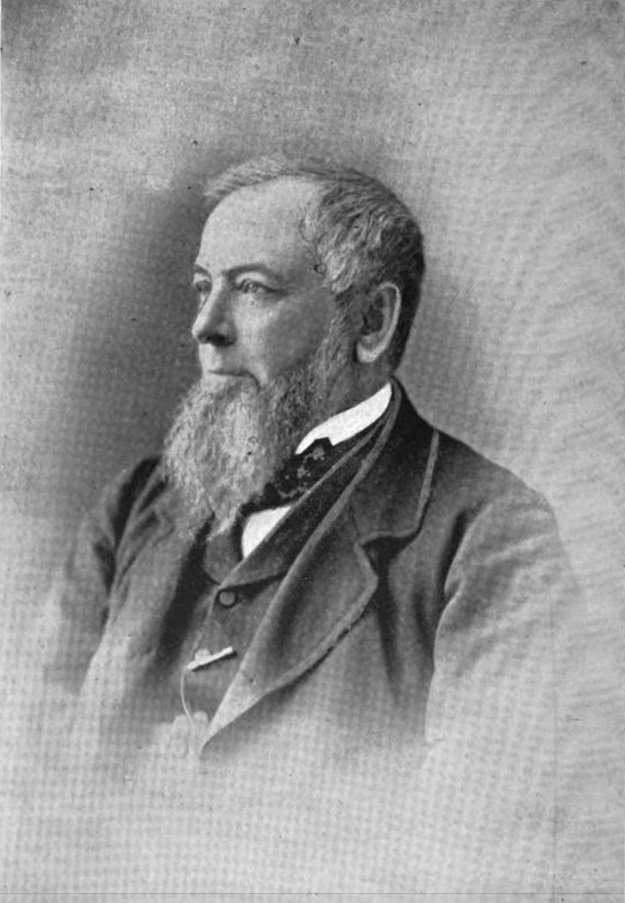
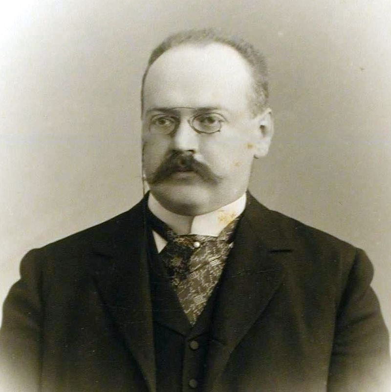
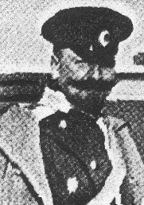
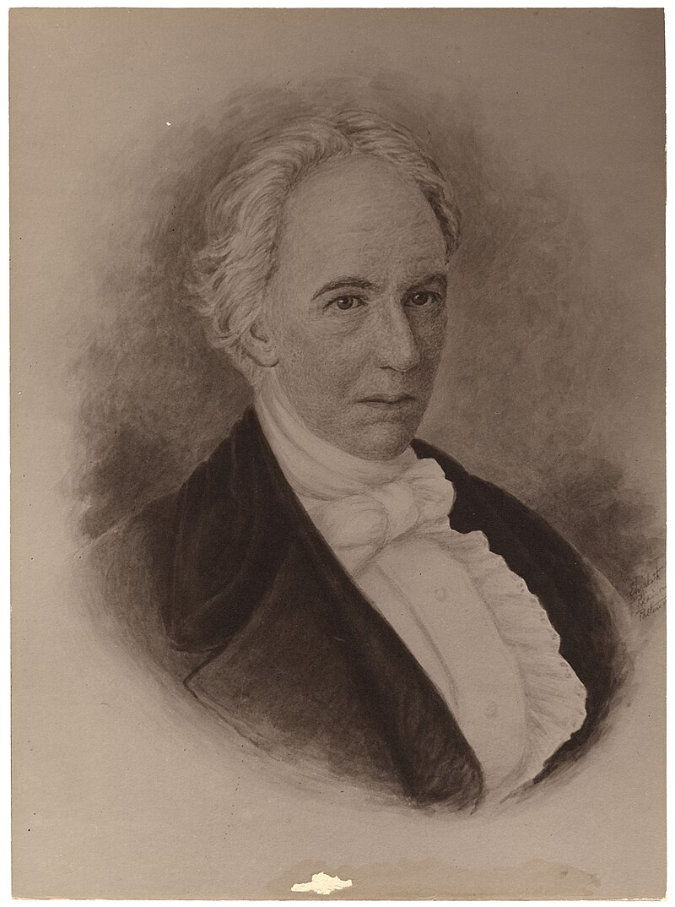
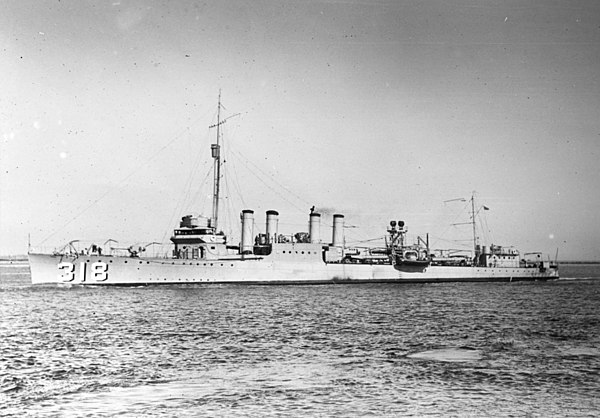
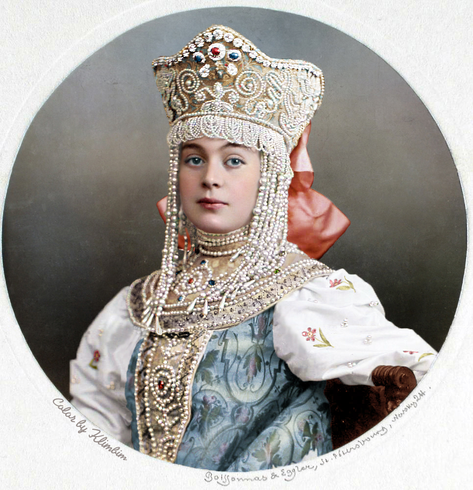

## Peeps in the Family

Theo Armour \~ 2025-01-12

## Introduction

Over the years, I have collected information about our ancestors. Here are some of the more notable ones.

One asks: Where are the women?

## Genealogy apps

Here are some of the genealogy apps I have used:

* <https://www.geni.com/people/Theo-Armour/>
* <https://www.myheritage.com/site-family-tree-4195182/armour>
* <https://www.ancestry.com/invite-ui/accept?token=0ndb3_G88znH5CBIK9DxttUTB8_paEYiv_-z7-xfbkA=> ~ must have an account to view
* <https://www.wikitree.com/wiki/Armour-1598>

## George Armour \~ paternal great-great grandfather

* (1812 – 1881) Scottish American businessman and philanthropist
* [**https://en.wikipedia.org/wiki/George_Armour**](https://en.wikipedia.org/wiki/George_Armour)

## Alexander Trepov \~ paternal (maternal ) great-great grandfather

* (1862-1928) Prime Minister of the Russian Empire
* [**https://en.wikipedia.org/wiki/Alexander_Trepov**](https://en.wikipedia.org/wiki/Alexander_Trepov)

## Allison Vincent Armour \~ Great-great-uncle

* Conducted fifteen scientific expeditions for United States Department of Agriculture, Olympic Committee board member 1908-1914
* Page 23: [**http://mssa.library.yale.edu/obituary_record/1925_1952/1940-41.pdf**](http://mssa.library.yale.edu/obituary_record/1925_1952/1940-41.pdf)

## Norman Armour \~ paternal grandfather

* (1887– 1982) Career United States diplomat
* [**https://en.wikipedia.org/wiki/Norman_Armour**](https://en.wikipedia.org/wiki/Norman_Armour)

## Walter Lowrie \~ Paternal great-uncle

* (1868 – 1959) Kierkegaardian theologian and translator
* [**https://en.wikipedia.org/wiki/Walter_Lowrie_(author)**](https://en.wikipedia.org/wiki/Walter_Lowrie_(author))

## Albert Cameron Burrage \~ Maternal great-grandfather

* (1859 – 1931) Industrialist, attorney and philanthropist
* [**https://en.wikipedia.org/wiki/Albert_Burrage**](https://en.wikipedia.org/wiki/Albert_Burrage)

## Anne Bell Burrage \~ Maternal grandmother

* (1890 - 1983) Founder of The Herb Society of America
* [**https://www.herbsociety.org/about/history.html**](https://www.herbsociety.org/about/history.html)

## Theodor von Nieroth (1871–1952)

* 
* <https://et.wikipedia.org/wiki/Theodor_von_Nieroth_(1871%E2%80%931952)>

## Russell & Company

 * <https://en.wikipedia.org/wiki/Samuel_Russell>
 * <https://en.wikipedia.org/wiki/Russell_%26_Company>

## Erastas Foote

* First Attorney General for Maine
* <https://en.wikipedia.org/wiki/Erastus_Foote>

## James Whitehill Shirk

USS Shirk

* <https://en.wikipedia.org/wiki/USS_Shirk>

## Chandler Hovey

* <https://herreshoff.org/inductees/chandler-hovey/>

More

* Georgia clan
* Many Princes Kudashev
* Jean Armour Burns

Steps

* Deerings
* Howes

There’s more. See Princess Kudasheva

To be continued.

