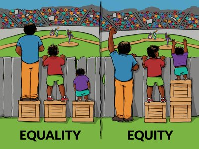

# BICOP at SPS

## paulies@groupsyahoo.com

paulies@groupsyahoo.com is a Yahoo groups mailing list set up many years ago - maybe even as far back as the nineties. The group is made up of alumni, parents, faculty and even maybe some students st. Paul's School Concord New Hampshire. The  list may have had seven or eight hundred members, but one must assume that now many of the email addresses on the list are no longer valid.

After the rise of Facebook, Instagram, Twitter and other social networks, this mailing list mostly fell into disuse. Out of the blue, in July of 2020, there occurred the following discussion:

## Initial message on Yahoo Groups from José Leos

Group:  https://groups.yahoo.com/neo/groups/SPSPaulies/info

Subscribe: spspaulies-subscribe@yahoogroups.com

Reposted from: https://www.bipocatsps.org/

I believe the names stands for "Black, indigenous & people of color at SPS"

Please read the text posted at bipocatsps first in order to make the following messages meaningful.

## Text of initial message ~ José Leos ~ joseleos@gmail.com ~ '91

Hello fellow Paulies!

**Subject: Letter to SPS Rector and Board**

I am a new member to the group.  

I want to share with this group a letter than a group of fellow alums and I drafted with a list of proposed initiatives that we are urging the school to take regarding diversity, equity, and inclusion. The letter can be accessed here:

https://www.bipocatsps.org/

I would appreciate your support by reading & signing the petition and then sharing it with others within the SPS community.

If you have any questions, please feel free to reach out to me. Thanks!

José Leos

415-377-3150

***

<i>Text from https://www.bipocatsps.org/</i>

<aside>

<h1>Letter to SPS rector and board regarding diversity, equity, and inclusion</h1>

As we reckon with our legacy of systemic racism as a nation, St. Paul’s School must also look deeply at our systems and culture to take steps to heal the past and build a just future for all students and alumni, specifically for people of color. We know the St. Paul’s School community continues to suffer from overt acts of racism, well-intentioned failures to deliver equity, and unconscious biases that harm us all. We have an opportunity at this moment to show leadership and vision in recognizing that past efforts have been too small and to make addressing racial justice a central priority of the school.

Beyond the initiatives outlined in the school’s June 25th letter, we ask the current leaders of the school to take these steps:

1. 𝗔𝘀𝘀𝗶𝗴𝗻 𝘁𝗵𝗲 𝗰𝘂𝗿𝗿𝗲𝗻𝘁 𝗮𝗹𝘂𝗺𝗻𝗶 𝗿𝗲𝗹𝗮𝘁𝗶𝗼𝗻𝘀 𝘀𝘁𝗮𝗳𝗳 𝘁𝗼 𝗺𝗮𝗸𝗲 𝗮𝗻 𝘂𝗻𝗽𝗿𝗲𝗰𝗲𝗱𝗲𝗻𝘁𝗲𝗱 𝗼𝘂𝘁𝗿𝗲𝗮𝗰𝗵 𝘁𝗼 𝗮𝗹𝗹 𝗮𝗹𝘂𝗺𝗻𝗶 𝗼𝗳 𝗰𝗼𝗹𝗼𝗿 𝘁𝗼 𝗿𝗲𝗾𝘂𝗲𝘀𝘁 𝘁𝗵𝗲𝗶𝗿 𝗽𝗮𝗿𝘁𝗶𝗰𝗶𝗽𝗮𝘁𝗶𝗼𝗻 𝗮𝗻𝗱 𝗶𝗻𝘀𝗶𝗴𝗵𝘁 𝗶𝗻𝘁𝗼 𝗮𝗹𝗹 𝗼𝗳 𝘁𝗵𝗲 𝗳𝗼𝗹𝗹𝗼𝘄𝗶𝗻𝗴. We are confident that participation from a broad, engaged group of alumni of color will make all of the following initiatives stronger and more successful.

	2. 𝗙𝗼𝗹𝗹𝗼𝘄 𝘁𝗵𝗲 𝘀𝗰𝗵𝗼𝗼𝗹’𝘀 𝗳𝗼𝘂𝗻𝗱𝗶𝗻𝗴 𝗽𝗿𝗶𝗻𝗰𝗶𝗽𝗹𝗲𝘀 𝗮𝗻𝗱 𝘃𝗮𝗹𝘂𝗲𝘀 𝗯𝘆 𝗰𝗼𝗺𝗺𝗶𝘁𝘁𝗶𝗻𝗴 𝗿𝗲𝘀𝗼𝘂𝗿𝗰𝗲𝘀 𝘁𝗼 𝗮𝗻𝘁𝗶-𝗿𝗮𝗰𝗶𝘀𝗺 𝗮𝗻𝗱 𝗶𝗻𝗰𝗹𝘂𝘀𝗶𝗼𝗻.
	 No efforts can be fully realized if we do not evaluate our core principles and align our actions and resources accordingly.
	 a. 𝗖𝘂𝗿𝗿𝗶𝗰𝘂𝗹𝘂𝗺. Direct the current alumni relations staff and school faculty to seek out alumni of color and other content experts to:
	  &nbsp; i) Deliver curriculum for the education of the whole community (faculty, staff, and students) on antiracism and ally training;
	  &nbsp; ii) Expand academic and enrichment programs for students and alumni of color;
	  &nbsp; iii) Provide other initiatives to ensure that students of color are fully served by the school in and out of the classroom;
	  &nbsp; iv) Provide tutoring for incoming students who may require extra educational support; and
	  &nbsp; v) Incorporate professional development opportunities for faculty, staff, and board of trustees that promotes social justice and anti-racism across all disciplines.
	 b. ğ—™ğ—®ğ—¶ğ˜ğ—µ. Together with the school chaplains, school leadership, and support from the Episcopal Diocese of New Hampshire commit resources and time to incorporate the Presiding Bishop’s Sacred Ground curriculum into the process of healing for the school. As an “academic community founded in the Episcopal tradition and rooted in enduring humanistic values,†it’s time to practice what we preach and live up to our foundational values.

	3. 𝗖𝗼𝗻𝘁𝗶𝗻𝘂𝗲 𝘁𝗼 𝘀𝘂𝗽𝗽𝗼𝗿𝘁 𝗮𝗻𝗱 𝗺𝗲𝗲𝘁 𝘁𝗵𝗲 𝗻𝗲𝗲𝗱𝘀 𝗼𝗳 𝗰𝘂𝗿𝗿𝗲𝗻𝘁 𝘀𝘁𝘂𝗱𝗲𝗻𝘁𝘀 𝗼𝗳 𝗰𝗼𝗹𝗼𝗿 𝗮𝗻𝗱 𝗶𝗻𝗰𝗿𝗲𝗮𝘀𝗲 𝗳𝗮𝗰𝗶𝗹𝗶𝘁𝗮𝘁𝗶𝗼𝗻 𝗳𝗼𝗿 𝗮𝗹𝘂𝗺𝗻𝗶 𝗼𝗳 𝗰𝗼𝗹𝗼𝗿 𝘁𝗼 𝗯𝗲 𝗮𝘃𝗮𝗶𝗹𝗮𝗯𝗹𝗲 𝘁𝗼 𝘀𝘂𝗽𝗽𝗼𝗿𝘁 𝗰𝘂𝗿𝗿𝗲𝗻𝘁 𝘀𝘁𝘂𝗱𝗲𝗻𝘁𝘀. 
	Alumni of color who do not currently engage with the school or donate to the annual fund may be inspired to support current students directly. Consider expanding support in the following areas:
	 a. Funds to support college test prep
	 b. Funds to support parent visits especially at parents weekend
	 c. Connect the parents of students with alumni in their area who can offer advice and support before students arrive on campus
	 d. Funded summer abroad opportunities
	 e. Funded summer internships in various fields of interest
	 f. Student stipends
	 g. Connections to alumni for job shadowing opportunities
	 h. Opportunities to stay on campus during the summer
	 i. Alliance with other schools with distinct programming, retreats, and support
	 j. Emergency Aid

	4. 𝗖𝗵𝗮𝗻𝗴𝗲 𝘁𝗵𝗲 𝘀𝗰𝗵𝗼𝗼𝗹 𝗰𝘂𝗹𝘁𝘂𝗿𝗲 𝗮𝗻𝗱 𝗶𝗺𝗽𝗹𝗲𝗺𝗲𝗻𝘁 𝗮𝗰𝗰𝗼𝘂𝗻𝘁𝗮𝗯𝗶𝗹𝗶𝘁𝘆 𝗳𝗼𝗿 𝗿𝗮𝗰𝗶𝗮𝗹 𝗷𝘂𝘀𝘁𝗶𝗰𝗲, 𝗱𝗶𝘃𝗲𝗿𝘀𝗶𝘁𝘆, 𝗮𝗻𝗱 𝗶𝗻𝗰𝗹𝘂𝘀𝗶𝗼𝗻, rather than merely supporting students of color and asking that they navigate, adjust, and adapt to St. Paul’s. 
	 a. Expand LINC curriculum in the area of antiracism and ally training
	 b. Review all academic curriculum with a perspective of equity and inclusion.
	 c. Keep transparent metrics on faculty recruiting and retention, student demographics, leadership roles, and alumni participation.

	
	5. 𝗥𝗲𝗰𝗿𝘂𝗶𝘁 𝗮 𝗻𝗲𝘄 𝗰𝗼𝗼𝗿𝗱𝗶𝗻𝗮𝘁𝗼𝗿 𝗼𝗳 𝗮𝗹𝘂𝗺𝗻𝗶 𝗿𝗲𝗹𝗮𝘁𝗶𝗼𝗻𝘀 𝗳𝗼𝗿 𝗱𝗶𝘃𝗲𝗿𝘀𝗶𝘁𝘆 𝗮𝗻𝗱 𝗲𝗾𝘂𝗶𝘁𝘆.
	 There is no excuse for failure in filling this position. The school must demonstrate its commitment in this area by funding this position at a level that values this work. This goal of this position is to foster a sense of belonging for current students of color by significantly increasing participation by alumni of color in school events, alumni events, and recruitment events. We believe that increasing the visibility of alumni of color will strengthen the entire SPS alumni network by reflecting the genuine diversity of our alumni base. The person in this position should be recruited from the SPS alumni of color community. They would do the following:
	 a. Build an outreach database of diverse alumni
	 b. Organize events for this community, do outreach to this community for all alumni events, work with the rest of the alumni office to make sure that alumni of color are actively welcomed to all alumni events.
	 c. Increase opportunities for alumni of color to visit SPS and be seen by students.
	 d. Facilitate informal gatherings for this community organized by alumni volunteers on and off-campus.
	 e. Consult alumni of color in planning events such as the MLK weekend and work with alumni volunteers to expand and strengthen that experience
	 f. Build relationships with other similar boarding school coordinators in order to create a support network for students and faculty of color.

6. 𝗣𝗿𝗶𝗼𝗿𝗶𝘁𝗶𝘇𝗲 𝗿𝗲𝗰𝗿𝘂𝗶𝘁𝗶𝗻𝗴 𝗮𝗻𝗱 𝗿𝗲𝘁𝗮𝗶𝗻𝗶𝗻𝗴 𝗲𝘅𝗰𝗲𝗹𝗹𝗲𝗻𝘁, 𝗱𝗶𝘃𝗲𝗿𝘀𝗲 𝗳𝗮𝗰𝘂𝗹𝘁𝘆, 𝗺𝗲𝗻𝘁𝗮𝗹 𝗵𝗲𝗮𝗹𝘁𝗵 𝗰𝗼𝘂𝗻𝘀𝗲𝗹𝗼𝗿𝘀, 𝗮𝗻𝗱 𝗮𝗱𝗺𝗶𝗻𝗶𝘀𝘁𝗿𝗮𝘁𝗼𝗿𝘀.  Invest whatever it takes. There will be no success in this area if every year there are only one or two faculty members.

	

7. 𝗙𝘂𝗻𝗱 𝗵𝗼𝘂𝘀𝗲 𝗮𝗱𝘃𝗶𝘀𝗼𝗿𝘀 whose other duties are designed to make it possible for them to prioritize creating a support structure for students and advocating for them with the administration. 
	a. The school must develop a process to hold students and faculty accountable when they receive reports of racism or bias. This could happen within the existing disciplinary process or a community counseling model.

	8. 𝗔𝗰𝘁𝗶𝘃𝗲𝗹𝘆 𝗲𝗻𝗴𝗮𝗴𝗲 𝘄𝗶𝘁𝗵 𝘁𝗵𝗲 𝗖𝗼𝗻𝗰𝗼𝗿𝗱 𝗰𝗼𝗺𝗺𝘂𝗻𝗶𝘁𝘆 to address the ongoing racism experienced by students of color to protect students and improve relations with the community.
	 a. Actively engage with the Concord community of businesses and law enforcement to prevent and confront racist aggressions experienced in town by SPS Students.
	 b. Build protective systems for students to have affirmative, immediate help, and support in town.
	 c. Facilitate connection to the Concord community including Concord High School students.

We know that until we listen carefully to the experiences and the needs of alumni and students of color, we will not be able to acknowledge and change as needed. The eight steps listed above are essential for building a structure to commit to hearing what is needed and making the changes to transform the school into a leader for equity and inclusion.

</aside>

***

## Reply #1 from Diane Moss ~ diane_moss@post.harvard.edu ~ '85

Jose,

Bravo. Thank you so much. I signed with this as a comment:

This is long overdue. I recall as a new 5th former that one of my fellow new classmates, a great girl from the Bronx and of I believe Puerto Rican descent, left after her first semester because she felt so alienated at the school. Diversity enriches experience - although at SPS, it was all too often feared. Many conversations while at the school and as an alum with classmates and faculty of color have confirmed that the school was all the more hard for them because of the attitudes toward minorities. Heck, I got hazed for being of Jewish descent, and I am white and came from an affluent family. I have only been able to imagine what it is like for people whose racial, class and cultural backgrounds are even more different than mine were from the majority at the school. I wholeheartedly support this initiative, have wanted the school to head in this direction for decades. I would think far more highly of the school and the integrity of its focus on service and compassion if such a program were to be implemented with seriousness and skill. I stand ready to help.

Appreciative,

Diane Moss, '85

## Reply #2 from Alexis H. Johnson ~ Aj2aj8484@aol.com ~ '76

Jose and Diane M and all:

This is a promising alumni initiative that Mr. Leos is a part of below. And, it is long overdue.

The full throated support of the School will of course only really be demonstrated if the Board and its practices and systems and the people of governance join; not to do what you and others can do well -- but, to change themselves, both individually and institutionally.   

There is a difference between 1) the SPS Board putting on the face and expression of support (or aiding in the distribution  of words) for you and the initiative -- and, 2) the Board changing itself and its commitments to practices that enable the systemic overhauls you are aiding to achieve and describing.   

Recall, the SPS Board has had blacks and people of color on it for what is by now a "long time."  

Did that make a difference?  How?  Maybe.  Maybe it was "quiet difference."  Did  it accelerate the current initiative of Mr. Leos at SPS?  Maybe indirectly, maybe not.  Did it aid in uncovering abuses or facing them? Not exactly. 

I have a kind of equity comment to share that may be hard to hear now, but is intended today without malice -- it is a plain observation:  

SPS Board members (and SPS Board alums) who are black or persons of color have attacked or denied or delayed the things I have done (or just avoided them from their position of fiduciary duty)  from the year 2001 to today.  The School and its form of Board practice for the last 20 to 50 years has not actually brought out the best in people.  Neither did the "Church and its traditions."  ... As we know only too well in the areas you are getting at and in the adult child abuse area (or child on child abuse) where abusers and the abused and the complicit were of all colors and largely devoted to silence.   

By now, and stated gently, some of the people  have come around.  Some are not now here to come around.  

This is stated simply to point out that change, character and courage are not colors.  These things are more like practiced devotions that need to be honed. Especially change.  Change is hard; which is why even very well meaning people (all or any of us for example) find it really hard -- for decades or more.  

The past is with us today at SPS.  But, the way ahead can be about change and thus the past can be meaningfully faced.  It starts with everyone -- including the SPS Board -- being visibly and vocally committed to change -- and committed, in my view, to let go of practices and ways that have not helped.  

Letting go is hard.  Whole books and practices are devoted to the subject.  

In my view, it helps to listen to kind, strong, humble people who are committed to these sorts of things.  Even when it is hard and even at SPS.  SPS has these folks, if it cares to listen in timely, unforced fashion. 

Thank you for your efforts Jose and all.  This should be good.  It can be good.   

Alexis '76
928-587-5191

## Reply #3 ~ Rory Johnston ~ rory7@sbcglobal.net ~ '62

Dear fellow Paulies,

I disagree strenuously with the assertion that St. Paul’s School is racist, failing to practice what it preaches or to live up to its foundational values. I would not be surprised if some of the students are racist, but that does not make the institution racist. The East Coast society and the Episcopal Church from which the school comes have long been hotbeds of liberalism. That is why Donald Trump hates them so much. Look at how SPS has influenced the world. Look at some of the names that have passed through the place: John Lindsay, John Kerry, Robert Mueller, Garry Trudeau, Bishop John Walker.

So, what is the “culture" that we are told must be changed? What is it about black students that SPS supposedly is asking them to adapt? What does it mean to "deliver equity"? We are directed to review all academic curricula with a perspective of equity and inclusion. How one does that with Euclidean geometry is a puzzle.

Reading through the entries on the Instagram page I note that among matters of concern are many that are of minimal significance or completely irrelevant. The worst instance was perpetrated by a teacher, not a student, and that teacher should have been fired at the time, as encouraging students is a fundamental part of the job.

The school has always catered to students of above average ability. How the school is going to select applicants to fit that in the absence of tests is a mystery. But if it continues that way it can only be inclusive in a very narrow sense.

Let us change what needs to be changed, and not join the frenzy that seeks to smash everything that is within reach. It is an error to think that those three deaths compel us to rethink our whole existence. There are many other deaths. The laws regarding police use of force are defectively drafted. The fact that a substantial number of American police officers are racist is not the fault of St Paul’s School.

Rory Johnston ’62

## Reply #4 ~ Brent Scudder ~ scudnut@aol.com ~ '56

I go along with Rory.  To give an example,  the school accepted its first Japanese student in 1947.  This was at a time when many students had fathers who had just come home from the war many of whom had suffered atrocities of the Japanese army and who may have well influenced a lot of their sons to hate all Japanese.  I think that was very forward thinking of the school.  As to how that student fared, I cannot say, but he did stay to graduate and there were many Japanese to follow.  We had Yoshiaki Shimizu  and Toshimichi Hirai when I was there in the early fifties and they were well regarded.

The fact that we have a Japanese chapter of the SPS Alumni Association in Tokyo is a tribute to the forward thinking of the school.
 
As for the school policy towards blacks at that time I would not know.  Did any apply?  I think the school was wise to put a black on the faculty first before giving out scholarships to deserving blacks.
 
The school has tried to be on the front lines when it came to loosening up its student body to include those beyond the Waspy Eastern Establishment as the social  mores among  society in general became more liberal over the years. 
 
Brent Scudder '56 

## Reply #5 ~ Theo Armour ~ t.armour@gmail.com ~ '65

José and Diane, Alexis, Rory & Brent

Thank you all for engaging, considered and intentional messages.

In all of this dialog I am reminded of a text we all know:

### The School Payer

_"Grant, O Lord, that in all the joys of life we may never forget to be kind. Help us to be unselfish in friendship, thoughtful of those less happy than ourselves, and eager to bear the burdens of others; through Jesus Christ our Savior. Amen."_

What resonates between the School Prayer and "[Letter to SPS rector and board regarding diversity, equity, and inclusion]( https://www.bipocatsps.org/ )" is that both are written in the present tense, demand agency and action, and are expressions of hope. There are no admissions of past guilt. There are no expressions of gratitude for past joys. There is is simply a call to seek outcomes that are equitable for all

Rory, Brent and Alexis: I hear you - and yet you are not as forward looking as the prayer. You discuss a past that I share. In my case, Bishop Walker and my '65 classmate Bob Hall were the first Black people I ever had a dialog with. For sure SPS has been less bad than many. For sure SPS - over the decades - has chosen to lift fingers many times. For sure we mostly did not forget to be kind.

Nonetheless there are still vast swaths of people in this world that have been and are denied the joy, friendship and happiness for which we have all prayed. And many are denied only because of their race.

The thrust in José's text is - like the prayer - forward looking. The text asks the future School to evolve so as to be eager to bear the burdens of others. The text asks that we the members of the School's community create plans for how to be thoughtful of those less happy than ourselves.

I do agree with Rory that there is currently a "frenzy" with much media hype regarding the relations between races. But the call to action for Saint Paul's School is timeless:  

1. Be a leader in racial equity in education - and not to cease until there are million or more schools as good as Saint Paul's
2. Establish metrics, guidelines and practices that help us to measure our failures and improvements
3. Celebrate all our differences and all our similarities

The representation of a pelican piercing its breast to feed its young with its own blood is called a [“Pelican in her Piety”]( http://www.thewestologist.com/symbols/the-symbol-of-self-sacrifice ). We all know this symbol well:

 
Now,  I'm not sure José wants us all to pierce our breasts, but I feel he is asking us to remember, to be unselfish and to bear the burdens of others. José, it's a bloody good plan.

Theo

***

AKA Norman Armour III '65

## Reply #6 ~ Diane Moss ~ todiane4@yahoo.com ~ '85

_private email to Theo_

Beautifully put. Thank you.

## Reply #7 ~ James G.R. Hart ~ jgrhart@gmail.com ~ '60

All,

To my mind, this talk of racism (not just at the school but throughout society) has missed the mark. Very simply put, to my mind, “racism” is one example of social justice. Especially the way it’s being bandied about, people accusing other people of “racism” often without clear proof and generally just to put the other party on the defensive.

To me the larger issue is “prejudice”, which basically is making decisions about people based on surface and often inaccurate information. In other words, not based on the truth. Prejudice is often…usually…based one one person’s ignoring or denying one of the basic tenets of our great nation, that all people are, because all were created by a loving God, created equal. Everyone deserves to be honored and respected. God created us all. This goes no matter what sex, or age, or form, or economic status. Etc. This is justice founded on the life and word of Christ. Expressed in the Gospels and in many of the letters of Paul (eg. Ephesians).

“Speaking [and acting] the truth in love.” And truth is not always nice. Truth requires courage. Courage based on Biblical, not political or any other kind of biased teachings.

Blessings,

Jim Hart ‘60

## Reply #8 ~ Theo Armour ~ t.armour@gmail.com ~ '65

Hi Jim

This is a very long and convoluted reply - and could use editing and clarification - sorry for this. But I hope it begins to address the notion that what José Leos proposes is more than bearing the burden of others. It may also be able add a new-found joy.

There are many truths in your message. It is hard to imagine a superior being acting on any universal principle other than random chance and the luck of the draw. We would not want fickle or temperamental gods (in the modern era anyway).   And, fingers crossed, the desires for theocracies based on groups of "chosen" people are fading.  Therefore, yes, "Everyone deserves to be honored and respected".

### Humans are capricious

Wait, there's more. Down here on the terrestrial plain, we human creatures seem to play a different game. We do play favorites, pick sides and place bets. As a result the outcomes here on earth are not so random. Some peeps get more than others.

I am not Black. I cannot speak for Black people. I cannot even begin to say that I control my biases.

But I can observe situations:

* When the ship is sinking, the outcry is "women and children first"
* As you walk into a public building you may observe the ramp for access by wheelchair
* After the Holocaust, the state of Israel came to be in much part because of the Holocaust 
* The Geneva convention demands humane treatment of your deadly enemy
* The Marshall plan produced and sent goods and services from the United States to the enemies recently defeated

The world really does have a history of following the call in our School Prayer about being "eager to bear the burdens of others" and also being selective about whose burdens are worth bearing.

We humans are capricious. We identify underdogs. We try to help. 

### Racism is everywhere

Here is another observation. After the Second World War, Aneurin Bevin, Minister of Health in England led the strategy that enabled the the British National Health Service in 1946 - leading to a system of medical practice that serves all-comers in the UK. At the same time Walter Reuther - as President of the United Automobile Workers Union - was part of the effort that made health care in the United States the responsibility of private employers - such as GM, Ford and Chrysler and unlike the rest of the world not a government obligation. Why? Because a national plan would have to include Black people. An employer-based plan could be tailored to fit the white union-members and exclude Black people. I do not have a good link to the Reuther involvement - and later he gets involved with Civil Rights and does favor a national plan so it does get complicated. But here are links to articles on racism in US medicine of that era: 

* https://www.nytimes.com/interactive/2019/08/14/magazine/universal-health-care-racism.html
* https://ssa.uchicago.edu/sites/default/files/uploads/JHSB04ExtraQuadagno.pdf
* https://www.ncbi.nlm.nih.gov/pmc/articles/PMC1447696/

There is health injustice in the United States with respect to Black people, indigenous people and people of color. The injustice is endemic, pervasive and total. The injustice is exacerbated by the current pandemic.

Health injustice is but one of the injustices that Black people live with.

### Uncle Edmund pays with his life

But let us come back to our School. Just look at life - and healthcare - from another perspective. In 1912, my great uncle Edmund as a first former at the School became ill and died of polio. My great-grandfather said that this should never happen again and donated the funds to build what was then called the Armour Infirmary. In my era we called it "The Cooler". I nearly died there myself in my first firm year of pneumonia. The thing is that for a number of years the Infirmary was the best hospital in New Hampshire. I don't think this was unusual. Everything about the School oozes being the best. Whatever happens, there are and have always been people that lift their fingers and write checks.

### Give light to all in the house

Is this merely the best school money could buy? Is that it? I want to think that there is more. I want to say to Saint Paul's School of Concord NH:

"You are the light of the world. A city set on a hill cannot be hid. Nor do men light a lamp and put it under a bushel, but on a stand, and it gives light to all in the house. Let your light so shine before men, that they may see your good works and give glory to your Father who is in heaven."—Jesus, from the Sermon on the Mount, Matthew 5:14-16.

A light is needed. We don't always see clearly. My guess is that most German people in Germany in WWII were not really cognizant that the Holocaust was happening. I think that there are a good number of people in America who are not aware of the racial injustice that occurs in our country here and now .

The call to action by José Leos is to let the light shine on racism. Not just in the Chapel and not just in the hockey rink. But to schools everywhere. Put the light "on a stand", and keep it bright until "it gives light to all in the house". For example: let a light shine on good practices that teachers feel are pedagogically informative in manifesting our racial biases. Let a light shine on usable metrics that heads of schools and school boards can use to identify bad and good racism-revealing practices. And provide head-lamps to students in learning pods that help enlighten their "spidey-sense" about a situation being valid.

I don't know how. I don't know where. But I hope that the "Letter to SPS rector and board regarding diversity, equity, and inclusion" shines a light to all in the house - and more. 

### Your candles shine as bright as my candle

Thinking about the process of enlightenment, reminds me of another useful quote.

“He who receives an idea from me, receives instruction himself without lessening mine; as he who lights his taper at mine, receives light without darkening me.” —Thomas Jefferson 

Our tapers may be the finest, most expensive tapers there are. Not to worry. Your tapers - no matter how humble - once lit may shine a light as just bright as ours. And more to the point, our collaboration did not cost us a penny.

For sure, Saint Paul's School is a "city on the hill". Now step back a bit. Note that there are other hills out there. Would it not be totally cool to see lights on all those hills?

Now I don't care how many billionaire parents there are out there, but there are not enough to put tapers on all the hills. And asking you to be "eager to bear the burden of others" should not send you to the poor house.

There is a simpler, faster, cheaper way: Just share the skills, techniques, lessons-learned and insights on how to make the tapers. 

In the context of this email thread, that means taking the workflow that José Leos proposes and actively sharing the processes with the other side of Pleasant Street in Concord (which includes Concord High ) and with all comers - via people, papers and programs - on all the hills everywhere.

And in doing so, let the bearing the burden of others become a piece of cake.

Theo

***

AKA Norman Armour III '65

## Reply #9 ~ Ruth E Sanchez ~ ruthmaria29@yahoo.com ~ Former faculty

I want to acknowledge this magnificent response by Theo, aka Norman Armour III.  In reading this letter, I learned  the history of SPS  health centers, and more about donors and students. By supporting Jose Leos,  I also learned of the generosity of spirit, and wit of the writer.  Thank you for this response.  I am glad you are a SPS 

alumn, this is inspiring.  After reading Notes on Silencing, I began to quit on SPS,  except I am encouraged  by the courage, grit, integrity and commitment of  black, Latinox, Native Americans,  Asian students  and Alexis Johnson.  
Good letter, goof thoughts, good man.  

Ruth E Sánchez 
Former faculty 

## Reply #10 ~ Marcy Chong ~ marcy.chong@seiu.org ~ '91

Theo -

I am SPS '91 and Parent '21 and one of the authors of the letter urging SPS to take leadership in the area of diversity, equity & inclusion.

Jose Leos - my formmate and 1 of the co-authors of the letter - just fwd'd your letter to our group chat.
I want you to know that your words are beautiful and heartening. Hearing from someone 25 years before my time who really gets it is an inspiration. Truly, as you point out, we are a group that is committing our time and devotion to the school to help move it forward where it needs to be in order to keep on coming closer to our best selves. 
Kelly Clark - Rector during my years - was always reminding us to learn those things on earth the knowledge of which continues in the heavens. Of all the things that might be revealed to us after this life, I am most confident that the ability to acknowledge and shed our prejudices is part of that curriculum. 

It has been a long day with a lot of tricky conversations - all people doing their best with varying degrees of success - so I want to thank you for taking the time to write so thoughtfully and with patience and wisdom. 
Marcy Chong 

Marcy Chong

Assistant Director of Strategic Initiatives
Service Employees International Union
202-213-9645

## Reply #11 José Leos ~ joseleos@gmail.com ~ '91

Thank you for reading the letter and taking the time to share your thoughts.  

While the letter was a group effort by several alums in my & surrounding forms from the early 90s, the following are my personal thoughts.  I also acknowledge that this note could probably benefit from some editing, but I felt compelled to reply sooner rather than later, so it will suffer from some incomplete thought.

My experience at SPS was generally positive.  However, because I see  that (1) not everyone is lucky enough to have my experience, and (2) the support network that I had is largely missing today, that is motivation to help resolve the school’s failings and prevent more and more students/alums of color from feeling disenfranchised and/or failing to achieve get the education that SPS promised.

Moreover, I do acknowledge that SPS is a microcosm of society in general, so racism, sexism, prejudice, etc. will occur at SPS.  That is not what I want to discuss or debate.  What I want to address are the systematic failures by the school to deliver equity.  To me, simply admitting students of color to SPS is not sufficient.  I hear too often that SPS does not provide the metaphorical “wheelchair ramp” to help students of color succeed.  I just want every student to have an equal opportunity to succeed.  

Over the last 2-3 years, I have been working closely with the school on a different but related initiative.  During that time, I have spoken to dozens & dozens, maybe hundreds, of alums and students of color; I hear the same stories over and over.  To me, this points to a clear pattern of systemic failures.  For me, the school needs to do the prioritize reaching out to alums & students to learn more about the problem.  Only then can the problem be addressed.  

Ultimately, I want the school to move beyond just striving for diversity to simply get the perfect photo opp.  For me, SPS should be striving to be a leader for equity and inclusion.  For me that starts with the school committing to reaching out to students/alums of color to understand their challenges, then investing in solving the problem, and establishing a governance framework to ensure progress.

I happy to continue the discussion with those who have any comments or feedback.

Thanks,

José 

____________________________________
José Leos
+1 415 377-3150 m

## Reply #12 ~ José Leos ~ joseleos@gmail.com ~ '91

Theo-

I would welcome meeting up.  It looks like we have several things in common beyond SPS, including living in SF and tech.  If the SPS directory is correct, we are only about 1 mi apart from each other.   I recently had a call with another SPS alum from 1975.  After speaking for 2 hours, we realized that we were both from El Paso, TX, graduated from Stanford, lived in the same freshman dorm at Stanford, and followed the same freshman “track” while at Stanford.

Time permitting, I would also love to chat about Pelican Launch which is an initiative on which I am working.  Like a start-up venture, Pelican Launch is also in the midst of a pivot due to some recent news we received from SPS.  However, our mission is still to help prevent disenfranchisement within the SPS community by helping students and alums succeed while at SPS and beyond SPS.  The project is open to all SPS community members, but the focus is on people of color, women, and members of the LGBQT, succeed   In a way, we are trying to make the “old boys network” less exclusive and include all members of the SPS community.  Here is a overview:
Https://link.pelicanlaunch.com/overview 

At one point, we were looking to raise a venture fund for SPS-related ventures, which resembled the funds that many universities now have.  However, we quickly realized that the SPS entrepreneur community is too small to support such a fund.  However, I still hold out hope that we can create a community around entrepreneurs and maybe create a syndicate of angels.  

Talk soon,

José 

____________________________________
José Leos
+1 415 377-3150

***

